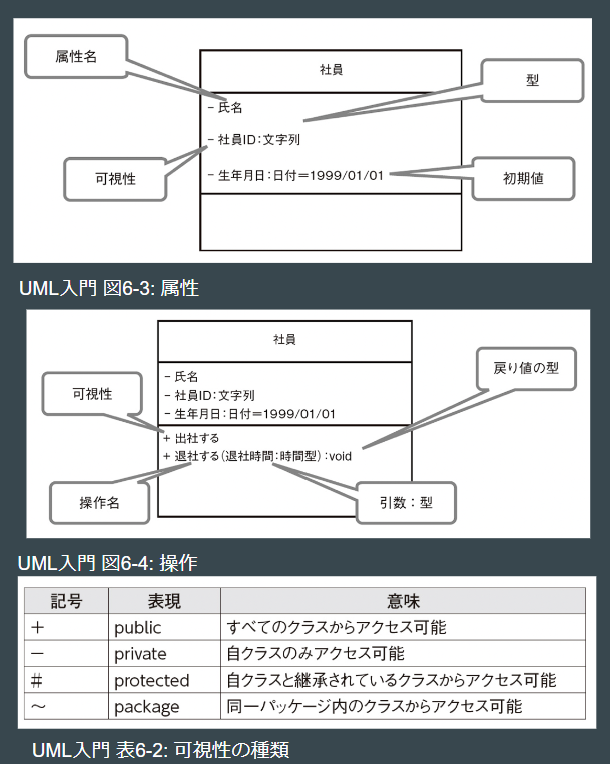
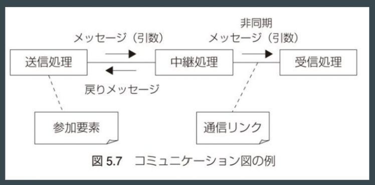

[back](/webdocs/git0724)

# ソフトウェア工学 05

## UML

<br>

>> Unified Modeling Language (UML)

UMLとは万国共通の記法であり、システムの振る舞いや構造を図示する際に描き方が人によって異なると不便であることから、標準規格として作られたものである。おもにオブジェクト指向プログラミングで使われ、2021年の時点で有名な「クラス図」「シークエンス図」等を含む14種類の図が定義されている。

<br>

**システムの構造を記述する図**
```
・クラス図
・コンポーネント図
・オブジェクト図
・配置図
・パッケージ図
・コンポジット構造図
・プロファイル図
```

* クラス図  
抽象化されたオブジェクトの型を定義し、型ごとに分類された塊の関係性を結んでいくことで、図示していく方法。



* オブジェクト図  
クラス図を」作成するための中間生成物的な位置づけで、クラスに中身を入れた状態のものを指す。

<br>

**システムの振る舞いを記述する図**
```
・ユースケース図
・シークエンス図
・コミュニケーション図
・状態マシン図
・アクティビティ図
・タイミング図
・相互作用概要図
```

* シークエンス図  
時間の前後関係やタイミングを表現する際に用いられる方法。

* コミュニケーション図  
シークエンス図を書き換えたもので、接続状態やネットワーク構成を表現するのによく使われる。




<br>

****